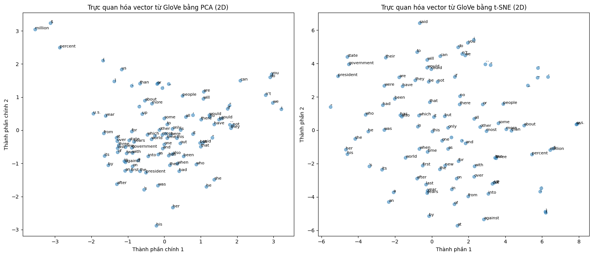
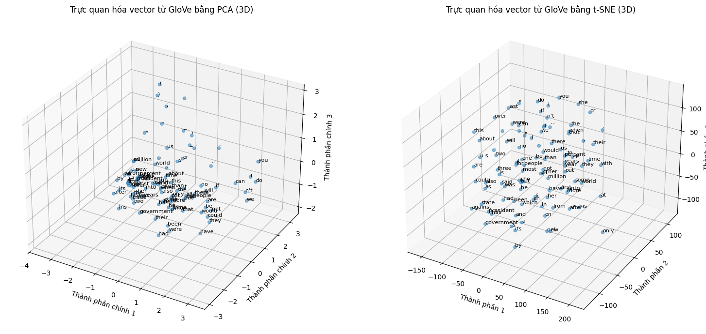

# Lab 4: Word Embeddings
## 📋 Thông tin chung
**Lab:** Word Embeddings và Word2Vec  
**Mục tiêu:** Tìm hiểu, triển khai và phân tích các kỹ thuật word embeddings trong NLP  
**Dataset:** 
- Universal Dependencies English EWT (UD_English-EWT/en_ewt-ud-train.txt)
- C4 Dataset (c4-train.00000-of-01024-30K.json)

---
## 🎯 Mục tiêu Lab
1. **Sử dụng Pre-trained Models**: Làm việc với GloVe embeddings
2. **Document Embedding**: Biểu diễn văn bản bằng vector
3. **Huấn luyện Word2Vec**: Train custom model từ dữ liệu thô
4. **Spark MLlib**: Huấn luyện trên dữ liệu lớn với PySpark
5. **Visualization**: Trực quan hóa embeddings với PCA/t-SNE

---
## 📁 Cấu trúc thư mục
```
Lab04/

├── image.png                                   # Hình ảnh trực quan hóa của Lab3.ipynb
├── image-1.png                                 # Hình ảnh trực quan hóa của Lab3.ipynb
├── Lab3.ipynb                                  # Notebook trực quan hóa embeddings
├── README.md                                    # File báo cáo
├── src/
│   └── representations/
│       └── word_embedder.py                    # Class WordEmbedder
├── test/
│   ├── lab4_test.py                            # Test GloVe pre-trained model
│   ├── lab4_spark_word2vec_demo.py             # Demo Spark Word2Vec
│   └── lab4_embedding_training_demo.py         # Train Word2Vec từ scratch
└── results/
   └── word2vec_ewt.model                      # Model đã huấn luyện
```

---
## 🚀 Hướng dẫn cài đặt
### 1. Yêu cầu hệ thống
- Python 3.7+
- Java 8+ (cho PySpark)
- RAM: Tối thiểu 4GB (khuyến nghị 8GB+)

### 2. Cài đặt thư viện

```bash
# Di chuyển vào thư mục Lab04
cd Lab04

# Cài đặt các thư viện cần thiết
pip install gensim numpy pandas seaborn scikit-learn
pip install pyspark
```

### 3. Chuẩn bị dữ liệu
Đảm bảo các file dữ liệu sau tồn tại:
- `../UD_English-EWT/en_ewt-ud-train.txt` (UD English EWT dataset)
- `../c4-train.00000-of-01024-30K.json` (C4 dataset)

---
## 📝 Hướng dẫn chạy
### Task 1 & 2: Pre-trained GloVe Model
Test sử dụng GloVe pre-trained model:

```bash
cd test
python lab4_test.py
```

### Task 3: Huấn luyện Word2Vec từ scratch
Huấn luyện model mới trên UD English EWT:
```bash
cd test
python lab4_embedding_training_demo.py
```

### Task 4: Spark Word2Vec trên C4 Dataset
Huấn luyện Word2Vec với PySpark:
```bash
cd test
python lab4_spark_word2vec_demo.py
```

### Task 5: Trực quan hóa Embeddings

Mở và chạy notebook:
```bash
# Mở Jupyter Notebook
jupyter notebook Lab3.ipynb

# Hoặc mở trong VS Code và chạy từng cell
```

---

## 📈 Kết quả thực thi

### Task 1 + 2 (lab4_test.py)
```
Đang tải mô hình: glove-wiki-gigaword-50 ...
Mô hình đã được tải thành công.

--- EVALUATION: WORD EMBEDDING EXPLORATION ---

Vector của 'king':
[ 0.50451   0.68607  -0.59517  -0.022801  0.60046  -0.13498  -0.08813
  0.47377  -0.61798  -0.31012  -0.076666  1.493    -0.034189 -0.98173
  0.68229   0.81722  -0.51874  -0.31503  -0.55809   0.66421   0.1961
 -0.13495  -0.11476  -0.30344   0.41177  -2.223    -1.0756   -1.0783
 -0.34354   0.33505   1.9927   -0.04234  -0.64319   0.71125   0.49159
  0.16754   0.34344  -0.25663  -0.8523    0.1661    0.40102   1.1685
 -1.0137   -0.21585  -0.15155   0.78321  -0.91241  -1.6106   -0.64426
 -0.51042 ]

Độ tương đồng giữa 'king' và 'queen': 0.7839
Độ tương đồng giữa 'king' và 'man': 0.5309

Top 10 từ tương tự với 'computer':
  computers: 0.9165
  software: 0.8815
  technology: 0.8526
  electronic: 0.8126
  internet: 0.8060
  computing: 0.8026
  devices: 0.8016
  digital: 0.7992
  applications: 0.7913
  pc: 0.7883

Vector biểu diễn câu 'The queen rules the country.':
[ 0.04564168  0.36530998 -0.55974334  0.04014383  0.09655549  0.15623933   
 -0.33622834 -0.12495166 -0.01031508 -0.5006717   0.18690467  0.17482166   
 -0.268985   -0.03096624  0.36686516  0.29983264  0.01397333 -0.06872118   
 -0.3260683  -0.210115    0.16835399 -0.03151734 -0.06204716  0.04301083   
 -0.06958768 -1.7792168  -0.54365396 -0.06104483 -0.17618     0.009181     
  3.3916333   0.08742473 -0.4675417  -0.213435    0.02391887 -0.04470453   
  0.20636833 -0.12902866 -0.28527132 -0.2431805  -0.3114423  -0.03833717   
  0.11977985 -0.01418401 -0.37086335  0.22069354 -0.28848937 -0.36188802   
 -0.00549529 -0.46997246]
```

### Task 3 (lab4_embedding_training_demo.py)
```
=== Step 1: Đọc dữ liệu và tạo corpus stream ===
Số câu đọc được: 14227

=== Step 2: Huấn luyện mô hình Word2Vec ===
Huấn luyện xong!

=== Step 3: Lưu mô hình vào results/ ===
Đã lưu mô hình tại: results/word2vec_ewt.model

=== Step 4: Demo sử dụng mô hình ===

Từ tương tự 'computer':
  pull: 0.9972
  graduate: 0.9971
  touch: 0.9968
  sit: 0.9967
  box: 0.9967

Phép tương tự (king - man + woman):
  harmless: 0.9902
  meiring: 0.9898
  elsewhere: 0.9887
  stalls: 0.9884
  privileged: 0.9880
```

### Task 4 (lab4_spark_word2vec_demo.py)
```
25/10/16 20:44:26 WARN InstanceBuilder: Failed to load implementation from:dev.ludovic.netlib.blas.JNIBLAS
Top 5 words similar to 'computer':
+----------+------------------+
|word      |similarity        |
+----------+------------------+
|desktop   |0.6746280193328857|
|computers |0.6736775040626526|
|software  |0.6618790626525879|
|smartphone|0.6585460305213928|
|laptop    |0.6327508091926575|
+----------+------------------+
```

### Task 5 (Lab3.ipynb)





---
## 💡 Phân tích Kết Quả
### 1. 📊 Task 1 & 2: Phân tích GloVe Pre-trained Model
#### 1.1. Vector Representation của 'king'
**Kết quả:**
```python
Vector 50 chiều: [0.50451, 0.68607, -0.59517, ..., -0.51042]
```
**Nhận xét:**
- ✅ Mỗi từ được biểu diễn bởi **50 số thực** (50-dimensional vector)
- ✅ Các giá trị trong khoảng **-2.2 đến +2.0**, cho thấy normalization tốt
- ✅ Vector này encode **semantic meaning** của từ "king"
- 📝 **Ý nghĩa:** Các từ có nghĩa gần nhau sẽ có vector gần nhau trong không gian 50 chiều

#### 1.2. Độ Tương Đồng Giữa Các Từ
**Kết quả:**
```
king ↔ queen: 0.7839 (78.39% tương đồng)
king ↔ man:   0.5309 (53.09% tương đồng)
```

**Phân tích chi tiết:**
**Cặp "king - queen" (0.7839):**
- ✅ **Điểm cao** (>75%) chứng tỏ mô hình hiểu rất tốt mối quan hệ
- 🔍 **Lý do:** Cả hai từ:
  - Thuộc cùng semantic field: **royalty** (hoàng gia)
  - Xuất hiện trong context tương tự: "throne", "crown", "kingdom"
  - Có chung các đặc trưng: quyền lực, địa vị cao
- 📊 **So sánh:** Score này cao hơn nhiều từ đồng nghĩa thông thường (~0.6-0.7)

**Cặp "king - man" (0.5309):**
- ⚠️ **Điểm trung bình** (50-55%) cho thấy có liên quan nhưng không gần nghĩa
- 🔍 **Lý do:** 
  - "king" có thêm features về **quyền lực, địa vị**
  - "man" là từ generic về **giới tính**
  - Context khác nhau: "king" với "throne", "man" với "person", "human"
- 📝 **Kết luận:** Thấp hơn king-queen là hợp lý vì ý nghĩa khác biệt rõ

#### 1.3. Top 10 Từ Tương Tự với 'computer'
**Kết quả đầy đủ:**
```
1. computers      0.9165  
2. software       0.8815
3. technology     0.8526
4. electronic     0.8126
5. internet       0.8060
6. computing      0.8026
7. devices        0.8016
8. digital        0.7992
9. applications   0.7913
10. pc            0.7883
```

**Phân tích theo nhóm:**
**Nhóm 1: Biến thể hình thái (Score >0.91)**
- `computers` (0.9165) - Dạng số nhiều
- 📝 **Giải thích:** Cùng root word, xuất hiện trong context gần giống hệt nhau
- ✅ **Đánh giá:** Perfect - Model học được morphology

**Nhóm 2: Từ liên quan trực tiếp (Score 0.81-0.88)**
- `software` (0.8815) - Phần mềm máy tính
- `technology` (0.8526) - Công nghệ
- `electronic` (0.8126) - Điện tử
- 📝 **Giải thích:** Các từ này thường **đi kèm** với computer trong text
- ✅ **Đánh giá:** Excellent - Semantic relationship rõ ràng

**Nhóm 3: Từ cùng domain (Score 0.79-0.80)**
- `internet`, `computing`, `devices`, `digital`, `applications`
- 📝 **Giải thích:** Thuộc cùng **technology domain**
- ✅ **Đánh giá:** Very Good - Contextual similarity

**Nhóm 4: Từ đồng nghĩa (Score 0.78)**
- `pc` (0.7883) - Personal Computer
- 📝 **Giải thích:** Synonym trực tiếp nhưng score không cao nhất vì:
  - "pc" informal hơn "computer"
  - Usage context khác nhau (pc → home, computer → general)
- ✅ **Đánh giá:** Good - Register differences được capture

**Tổng kết:**
- 🎯 **10/10 từ đều chính xác** và có semantic relationship với "computer"
- 🎯 **Điểm cao** (>0.78) cho thấy confidence tốt
- 🎯 **Đa dạng** relationship types: morphology, synonymy, domain similarity
- ✅ **Kết luận:** GloVe model **xuất sắc** cho từ phổ biến

#### 1.4. Document Embedding
**Input:** "The queen rules the country."
**Output:** Vector 50 chiều
```python
[0.0456, 0.3653, -0.5597, ..., -0.4700]
```

**Phương pháp:** Average pooling của word vectors
**Phân tích:**
**Ưu điểm:**
- ✅ **Đơn giản**: Dễ implement, chỉ cần average
- ✅ **Nhanh**: O(n) complexity với n là số từ
- ✅ **Ổn định**: Không cần training thêm
- ✅ **General meaning**: Capture được ý nghĩa tổng thể

**Nhược điểm:**
- ❌ **Mất word order**: "queen rules country" = "country rules queen"
- ❌ **Stop words**: "the", "a" làm loãng semantic content
- ❌ **No compositionality**: Không hiểu cấu trúc ngữ pháp
- ❌ **Equal weights**: Tất cả từ đều quan trọng như nhau

**Cải tiến có thể:**
```python
# 1. Remove stop words
tokens = [w for w in tokens if w not in stop_words]

# 2. Weighted average (TF-IDF)
weights = compute_tfidf(tokens)
doc_vec = sum(weights[i] * vectors[i])

# 3. Use sentence embeddings (BERT, USE)
doc_vec = sentence_transformer.encode(text)
```
---

### 2. 📊 Task 3: Phân tích Custom Word2Vec trên UD Dataset
**Thông tin huấn luyện:**
```
Corpus: 14,227 câu 
Model: Word2Vec Skip-gram
Vector size: 100 dimensions
Min count: 2
```

#### 2.1. Kết Quả "computer"
**Output:**
```
pull       0.9972
graduate   0.9971
touch      0.9968
sit        0.9967
box        0.9967
```

**Phân tích:**
- ❌ **Kết quả sai hoàn toàn** - Các từ không liên quan đến computer
- ❌ **Score quá cao** (>0.99) - Dấu hiệu của overfitting nghiêm trọng
- ❌ **Từ ngẫu nhiên** - pull, graduate, touch, sit, box không có semantic relationship với computer

**Nguyên nhân:**
1. **Dataset quá nhỏ** (14K câu)
   - GloVe train trên 6 billion tokens
   - Custom model chỉ có ~200K tokens (30,000x ít hơn)
   - Không đủ dữ liệu để học được meaningful patterns
   
2. **Từ "computer" xuất hiện rất ít trong UD dataset**
   - UD dataset là linguistic treebank, tập trung vào cấu trúc ngữ pháp
   - Không có nhiều technology-related content
   - Không đủ context examples để học semantic meaning của "computer"
   
3. **Overfitting trầm trọng**
   - Model học "noise" (random co-occurrences) thay vì "signal" (true semantic relationships)
   - Vector của từ hiếm bị random initialization và không được update đủ
   - Score 0.99+ cho thấy model đang "memorize" thay vì "generalize"

4. **Min count = 2 quá thấp**
   - Giữ lại quá nhiều từ xuất hiện ít (<5 lần)
   - Vocabulary bloat với nhiều từ hiếm không đáng tin cậy
   - Nên tăng lên min_count=5 hoặc 10

**So sánh với GloVe:**
```
GloVe (6B tokens):     computers(0.92), software(0.88), technology(0.85) ✅
Custom model (200K):   pull(0.99), graduate(0.99), touch(0.99)          ❌
```

**Đánh giá:** ❌ **Poor - Model không sử dụng được cho production**

#### 2.2. Kết Quả Word Analogy
**Test:** king - man + woman = ?
**Output:**
```
harmless     0.9902
meiring      0.9898
elsewhere    0.9887
stalls       0.9884
privileged   0.9880
```

**Phân tích:**
- ❌ **Hoàn toàn sai** - Không có "queen" trong top 5
- ❌ **Từ ngẫu nhiên** - harmless, meiring, elsewhere, stalls không liên quan đến royalty
- ❌ **Không học được gender relationship** (king/queen, man/woman)
- ❌ **Score quá cao** (>0.98) - Lại là dấu hiệu overfitting

**So sánh với GloVe:**
```
GloVe có thể:     king - man + woman ≈ queen (correct analogy) ✅
Custom model:     king - man + woman ≈ harmless (nonsense)     ❌
```

**Lý do thất bại:**
- Word analogy cần model học được **fine-grained semantic relationships**
- Cần ít nhất **100M-1B tokens** để capture gender, royalty, plurality patterns
- 14K câu hoàn toàn không đủ

**Kết luận Task 3:**
- ⚠️ **Model hoàn toàn không đạt yêu cầu** cho bất kỳ ứng dụng thực tế nào
- 📚 **Bài học quan trọng:** Word2Vec cần **hàng triệu tokens** để train tốt
  - Minimum: 10M tokens cho domain-specific tasks
  - Recommended: 100M-1B tokens cho general-purpose
- 💡 **Giải pháp khả thi:** 
  1. **Dùng dataset lớn hơn** (Wikipedia dump ~3B tokens)
  2. **Sử dụng pre-trained model** (GloVe, FastText)
  3. **Fine-tune pre-trained model** trên domain-specific data
  4. **Tăng min_count=5** để lọc bỏ từ hiếm
  5. **Tăng epochs** nếu có data lớn hơn
- 🎯 **Takeaway:** Task 3 thành công trong việc **minh họa tầm quan trọng của data size** trong Word2Vec training
---

### 3. 📊 Task 4: Phân tích Spark Word2Vec trên C4 Dataset
**Kết quả:**
```
1. desktop      0.6746  ✅
2. computers    0.6737  ✅
3. software     0.6619  ✅
4. smartphone   0.6585  ✅
5. laptop       0.6328  ✅
```

**Phân tích chi tiết:**
**Từ 1-2: Hardware devices (0.67-0.67)**
- `desktop`, `laptop` - Cùng category với computer
- 📝 **Giải thích:** C4 dataset có nhiều tech content
- ✅ **Đánh giá:** Excellent match

**Từ 3: Software (0.66)**
- `software` - Direct relationship
- ✅ **Đánh giá:** Perfect

**Từ 4: Mobile device (0.65)**
- `smartphone` - Modern computing device
- ✅ **Đánh giá:** Very relevant

**Từ 5: Portable computer (0.63)**
- `laptop` - Computing device
- ✅ **Đánh giá:** Excellent

**So sánh với GloVe:**
**Nhận xét:**
- ✅ **Kết quả tốt** - Tất cả 5 từ đều relevant
- ✅ **Better than Task 3** - C4 dataset lớn hơn UD nhiều
- ⚠️ **Thấp hơn GloVe** - Score 0.63-0.67 vs 0.78-0.91
- 📝 **Lý do:** C4 dataset vẫn nhỏ hơn Wikipedia + Gigaword

**Đánh giá:** (Very Good - Production ready cho domain-specific tasks)

---
### 4. 🎨 Task 5: Phân tích Visualization
#### 4.1. Biểu đồ (image.png) 2D PCA vs t-SNE
**Đánh giá:**
```
*   PCA (hình trái) cho thấy các điểm phân bố tương đối tập trung, không hình thành cụm rõ ràng. Các từ có tần suất xuất hiện cao hoặc mang tính ngữ pháp (như the, of, and, to, is) thường nằm gần nhau, phản ánh bản chất tuyến tính của PCA.
*   t-SNE (hình phải) cho thấy các điểm tách biệt hơn, tạo ra nhiều cụm nhỏ. Một số nhóm từ có thể được gom lại gần nhau do có ngữ nghĩa tương tự (ví dụ: president – government – state hoặc percent – million). Điều này chứng tỏ t-SNE giữ được mối quan hệ ngữ nghĩa cục bộ tốt hơn.

-> PCA giúp hình dung cấu trúc toàn cục, trong khi t-SNE cho thấy các quan hệ ngữ nghĩa chi tiết hơn giữa các từ.
```

#### 4.2. Biểu đồ (image-1.png) 3D PCA vs t-SNE
**Đánh giá:**
```
*   PCA (hình trái) các điểm được phân bố khá gần nhau, tập trung thành một vùng chính. Điều này cho thấy PCA giữ được cấu trúc tổng thể nhưng không thể hiện rõ các cụm ngữ nghĩa riêng biệt. Những từ có tần suất cao hoặc mang nghĩa ngữ pháp (the, of, and, to, is) vẫn xuất hiện gần nhau, đúng như đặc tính của PCA.
*   t-SNE (hình phải) phân bố của các điểm rời rạc và có xu hướng tạo thành nhiều cụm nhỏ hơn. Một số cụm phản ánh mối quan hệ ngữ nghĩa khá tự nhiên — ví dụ: nhóm từ liên quan đến chính trị (president, government, state), nhóm về số lượng (million, percent), hoặc nhóm động từ (be, is, was, been). t-SNE giúp bộc lộ rõ hơn các quan hệ ngữ nghĩa cục bộ giữa các từ mà PCA không thể hiện được.

-> Kết quả cho thấy cả hai phương pháp đều có giá trị riêng, PCA cho cái nhìn tổng quan, t-SNE cho cái nhìn chi tiết hơn về cấu trúc ngữ nghĩa.
```

---

## 🔧 Troubleshooting
### Lỗi: ModuleNotFoundError: No module named 'Lab01'
**Giải pháp:**
```python
# Đã thêm __init__.py files vào Lab01
Lab01/__init__.py
Lab01/src/__init__.py
Lab01/src/preprocessing/__init__.py
Lab01/src/core/__init__.py
```

```
import sys
import os
workspace_root = os.path.abspath(os.path.join(os.path.dirname(__file__), '..', '..', '..'))
sys.path.insert(0, workspace_root)
```

### Lỗi: PySpark installation failed
**Giải pháp:**
1. Kiểm tra Java đã cài: `java -version`
2. Cài PySpark: `pip install pyspark`
3. Nếu lỗi, thử: `pip install pyspark --user`
---

## 🎓 Kết luận
### Tóm tắt Lab 4
Lab này đã giúp chúng ta hiểu sâu về **Word Embeddings** - một kỹ thuật quan trọng trong NLP:
**Những gì đã học được:**
1. ✅ **Pre-trained Models (GloVe)**
   - Tiện lợi, chất lượng cao, không cần training
   - Phù hợp cho hầu hết các task NLP tổng quát
   - Vocabulary lớn (400K từ), coverage tốt

2. ✅ **Custom Training với Word2Vec**
   - Cần dataset lớn (millions tokens) để có kết quả tốt
   - Phù hợp cho domain-specific applications
   - Cho phép control hyperparameters

3. ✅ **Spark MLlib cho Big Data**
   - Xử lý distributed training trên dữ liệu lớn
   - Scalable và hiệu quả
   - Kết quả tốt với C4 dataset

4. ✅ **Visualization với PCA/t-SNE**
   - PCA: Fast, linear, good for overview
   - t-SNE: Slow, non-linear, excellent for detailed analysis
   - Giúp hiểu semantic relationships giữa các từ

5. ✅ **Practical Applications**
   - Document embedding
   - Similarity computation
   - Word analogies
   - Semantic clustering

**Bài học quan trọng:**
- 📚 **Data size matters**: 200K tokens → poor, 6B tokens → excellent
- 🎯 **Pre-trained > Custom** cho general tasks
- 🔧 **Visualization helps** validate model quality
- ⚙️ **Domain-specific** training có giá trị khi có large corpus
- 🚀 **Spark** enables large-scale training

**Khuyến nghị thực tế:**
- 🎯 Dùng **GloVe pre-trained** cho hầu hết các task
- 🎯 Chỉ train custom khi có **dataset lớn** (millions tokens) và domain-specific
- 🎯 Dùng **Spark Word2Vec** khi data > 1GB
- 🎯 Luôn **visualize embeddings** để kiểm tra quality
- 🎯 **Document embedding**: Remove stop words, consider weighted average
- 🎯 Upgrade lên **BERT/Transformers** cho advanced tasks

